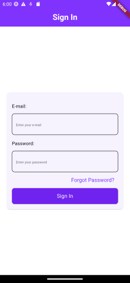

# CUSTOM_ATOMIC_DESIGN_CO

This package represents a `Sign_in` page create under the Atomic design system



## Overview

`CUSTOM_ATOMIC_DESIGN_CO` is a Flutter package designed to implement a design system based on Atomic Design principles. This package allows developers to create and maintain a consistent design system in their Flutter applications. Additionally, the package includes a showcase example to demonstrate each component's functionality.

## Table of Contents

- [Overview](#overview)
- [Getting Started](#getting-started)
  - [Installation](#installation)
  - [Usage](#usage)
- [Example](#example)
- [Components](#components)
  - [Atoms](#atoms)
  - [Molecules](#molecules)
  - [Organisms](#organisms)
  - [Templates](#templates)
  - [Pages](#pages)
- [Contributing](#contributing)
- [License](#license)

## Getting Started

### Installation

To install the package, add it to your `pubspec.yaml` file:

```yaml
dependencies:
  custom_atomic_design_co:
    git:
      url: https://github.com/tiancris01/CUSTOM_ATOMIC_DESIGN_CO.git
      ref: main
```

### Usage

To use the components from this package, import it into your Dart file:

```dart
import 'package:custom_atomic_design_co/custom_atomic_design_co.dart';
```

You can now use the components in your Flutter application.

## Example

A full example application is included in the example directory. To run the example:

1. Clone the repository.
2. Navigate to the example directory.
3. Run flutter pub get to get the dependencies.
4. Run flutter run to start the application.

The example showcases all components in action, demonstrating how to use them in your own projects.

## Components

### Atoms

Atoms are the smallest building blocks of your design. Examples include buttons, text fields, and labels.

### Example

```dart
class ButtonAtom extends StatelessWidget {
  const ButtonAtom({
    super.key,
    required Widget child,
    required VoidCallback onPressed,
  })  : _child = child,
        _hasBorder = false,
        _onPressed = onPressed;

  const ButtonAtom.border({
    super.key,
    required Widget child,
    required String label,
    required VoidCallback onPressed,
  })  : _child = child,
        _hasBorder = true,
        _onPressed = onPressed;

  final Widget _child;
  final bool _hasBorder;
  final VoidCallback _onPressed;

  @override
  Widget build(BuildContext context) {
    return ElevatedButton(
      style: ElevatedButton.styleFrom(
        backgroundColor: _hasBorder
            ? ColorFoundation.background.bgWhite
            : ColorFoundation.background.bgPrimary,
        foregroundColor: _hasBorder
            ? ColorFoundation.background.bgPrimary
            : ColorFoundation.background.bgWhite,
        shape: RoundedRectangleBorder(
          borderRadius: BorderRadius.circular(SizeFoundations.radius.r_8),
          side: BorderSide(
            color: _hasBorder
                ? ColorFoundation.border.borderDark
                : Colors.transparent,
            width: _hasBorder ? 1 : 0,
          ),
        ),
      ),
      onPressed: _onPressed,
      child: _child,
    );
  }
}
```

### Molecules

Molecules are groups of atoms bonded together and form a relatively simple UI component. Examples include a form label with an input field or a button group.

### Example

```dart
class SignInInputMolecule extends StatelessWidget {
  final String emailText;
  final String passwordText;

  final String emailTextFieldHint;
  final String passwordTextFieldHint;


  const SignInInputMolecule({
    super.key,
    required this.emailText,
    required this.passwordText,
    required this.emailTextFieldHint,
    required this.passwordTextFieldHint,
  });

  @override
  Widget build(BuildContext context) {
    return Column(
      children: [
        SizedBox(height: SizeFoundations.size.w_16),
        Align(
          alignment: Alignment.centerLeft,
          child: Text(emailText),
        ),
        SizedBox(height: SizeFoundations.size.w_12),
        TextFieldAtom(
          hintText: emailTextFieldHint,
          keyboardType: TextInputType.emailAddress,
        ),
        SizedBox(height: SizeFoundations.size.w_16),
        Align(
          alignment: Alignment.centerLeft,
          child: Text(passwordText),
        ),
        SizedBox(height: SizeFoundations.size.w_12),
        TextFieldAtom.password(
          hintText: passwordTextFieldHint,
          keyboardType: TextInputType.number,
        ),
      ],
    );
  }
}
```

### Organisms

Organisms are relatively complex UI components that form distinct sections of an interface. Examples include headers, footers, or a search bar with filters.

### Example

```dart
class SignInCardOrganism extends StatelessWidget {
  final SignInCardInputParams signInCardInputParams;
  final SignInCardButtonParams signInCardButtonParams;

  const SignInCardOrganism({
    super.key,
    required this.signInCardInputParams,
    required this.signInCardButtonParams,
  });

  @override
  Widget build(BuildContext context) {
    return Card(
      child: Padding(
        padding: EdgeInsets.all(SizeFoundations.radius.r_16),
        child: Column(
          children: [
            SignInInputMolecule(
              emailText: signInCardInputParams.emailText,
              emailTextFieldHint: signInCardInputParams.emailTextFieldHint,
              passwordText: signInCardInputParams.passwordText,
              passwordTextFieldHint:
                  signInCardInputParams.passwordTextFieldHint,
            ),
            Align(
              alignment: Alignment.centerRight,
              child: TextButton(
                onPressed: signInCardButtonParams.onForgotPasswordTap,
                child: Text(signInCardButtonParams.forgotPasswordText),
              ),
            ),
            Row(
              children: [
                Expanded(
                  child: SizedBox(
                    height: SizeFoundations.size.w_48,
                    child: ButtonAtom(
                      onPressed: signInCardButtonParams.onButtonTap,
                      child: Text(signInCardButtonParams.buttonText),
                    ),
                  ),
                ),
              ],
            ),
          ],
        ),
      ),
    );
  }
}
```

### Templates

Templates are page-level objects that place components into a layout and articulate the design's underlying content structure.

### Example

```dart
class SignInTemplate extends StatelessWidget {
  final String title;

  final SignInCardInputParams signInCardInputParams;
  final SignInCardButtonParams signInCardButtonParams;


  const SignInTemplate({
    super.key,
    required this.title,
    required this.signInCardInputParams,
    required this.signInCardButtonParams,
  });

  @override
  Widget build(BuildContext context) {
    return Scaffold(
      appBar: AppBarAtom(title: title),
      body: SafeArea(
        child: Padding(
          padding: EdgeInsets.all(SizeFoundations.size.w_16),
          child: Column(
            mainAxisAlignment: MainAxisAlignment.center,
            children: [
              SizedBox(height: SizeFoundations.size.w_16),
              SignInCardOrganism(
                signInCardInputParams: signInCardInputParams,
                signInCardButtonParams: signInCardButtonParams,
              ),
              SizedBox(height: SizeFoundations.size.w_16),
            ],
          ),
        ),
      ),
    );
  }
}
```

## Contributing

If you would like to contribute to this package, please follow these steps:

Fork the repository.
Create a new branch (git checkout -b feature-branch).
Commit your changes (git commit -am 'Add new feature').
Push to the branch (git push origin feature-branch).
Create a new Pull Request.

## License

This project is licensed under the MIT License - see the LICENSE file for details.

```vbnet
Feel free to modify the examples and descriptions to better match your package's actual implementation.
```
